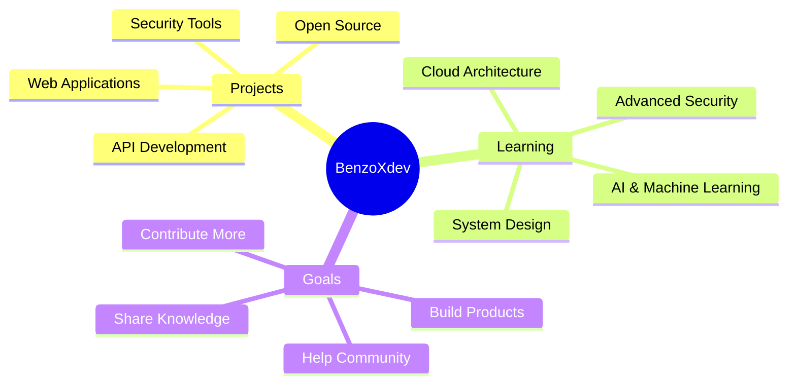

<div align="center">


<br/>


<br/>

[](https://github.com/benzoxdev)
[](https://github.com/benzoxdev?tab=followers)
[](https://github.com/benzoxdev?tab=repositories)

</div>

<br/>

##  About Me
```typescript
const BenzoXdev = {
    location: "Algeria 🇩🇿",
    role: "Full Stack Developer",
    code: ["JavaScript", "Python", "Java", "Go", "C#", "PHP", "Ruby", "Nim"],
    askMeAbout: ["Web Dev", "Cybersecurity", "API Design", "System Architecture"],
    technologies: {
        frontEnd: {
            languages: ["HTML", "CSS", "JavaScript"],
            frameworks: ["React", "Vue", "Angular"]
        },
        backEnd: {
            languages: ["Python", "Node.js", "PHP", "Java", "Go"],
            frameworks: ["Django", "Express", "Spring Boot"]
        },
        devOps: ["Docker", "Git", "Linux", "Shell Scripting"],
        databases: ["MySQL", "PostgreSQL", "MongoDB", "Redis"],
        tools: ["VS Code", "Git", "Docker", "Postman", "Vim"]
    },
    architecture: ["Microservices", "RESTful APIs", "Single Page Applications"],
    currentFocus: "Building scalable applications & exploring AI/ML",
    funFact: "I debug with console.log() and I'm not ashamed! 😄"
};
```

<div align="center">

## 🤝 Connect With Me

<a href="https://www.instagram.com/just._.benzo?igsh=MWEwZDczbDZld2J4cw==">
  
</a>
<a href="https://github.com/benzoxdev">
  
</a>
<a href="mailto:contact@benzoxdev.com">
  
</a>

</div>

<br/>


<br/>

##  Tech Stack

<div align="center">

### 💻 Languages

<p>
  
</p>

### 🎨 Frontend Development

<p>
  
</p>

### ⚙️ Backend & Databases

<p>
  
</p>

### 🛠️ DevOps & Tools

<p>
  
</p>

### ☁️ Cloud & Platforms

<p>
  
</p>

</div>

<br/>


<br/>

## 📊 GitHub Analytics

<div align="center">
  


</div>

<br/>

<div align="center">
  
### 📈 Contribution Graph


</div>

<br/>


<br/>

## 🏆 GitHub Achievements

<div align="center">


</div>

<br/>


<br/>

## 💡 Random Dev Quote

<div align="center">


</div>

<br/>

## 🐍 Contribution Snake

<div align="center">

<picture>
  <source media="(prefers-color-scheme: dark)" srcset="https://raw.githubusercontent.com/benzoxdev/benzoxdev/output/github-contribution-grid-snake-dark.svg">
  <source media="(prefers-color-scheme: light)" srcset="https://raw.githubusercontent.com/benzoxdev/benzoxdev/output/github-contribution-grid-snake.svg">
  
</picture>

</div>

<br/>


<br/>

## 🎯 Current Projects & Goals

<div align="center">


</div>

<br/>


<br/>

<div align="center">

### 💼 Open For Opportunities

**I'm always interested in collaborating on interesting projects!**


</div>

<br/>

<div align="center">

### ⚡ Fun Facts

🎮 When I'm not coding, I'm probably gaming or exploring cybersecurity challenges  
🌙 Night owl - my best code is written after midnight  
☕ Powered by coffee and curiosity  
🎯 Goal: Make the web a better and safer place

</div>

<br/>


<br/>

<div align="center">

### ❤️ Show Some Love

*If you like my work, consider giving some ⭐️ to my repositories!*


<br/><br/>

**💙 Thanks for visiting my profile! Let's build something amazing together!**


</div>
